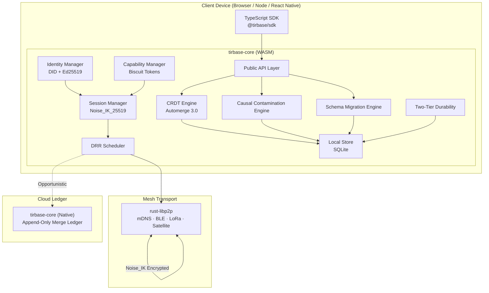
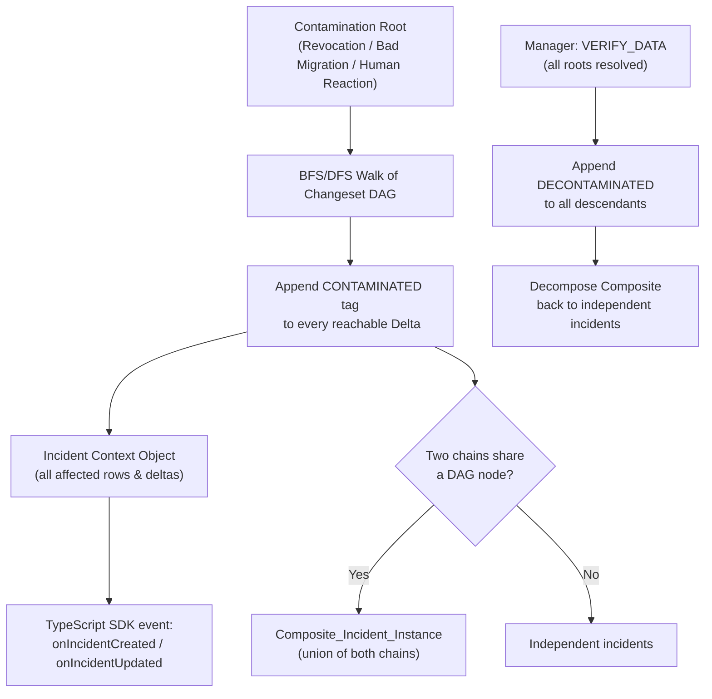
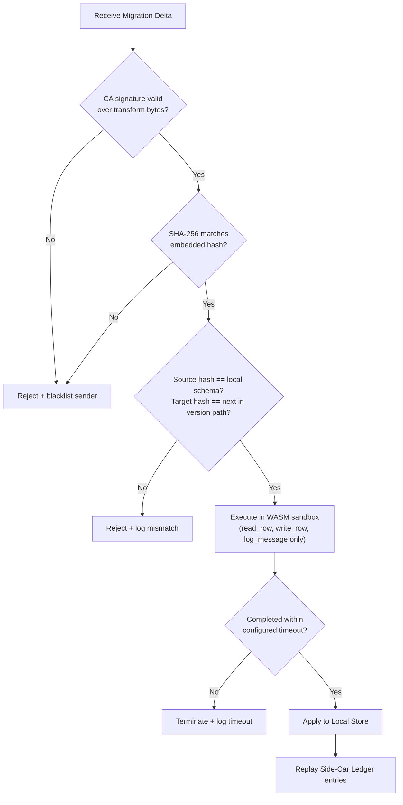
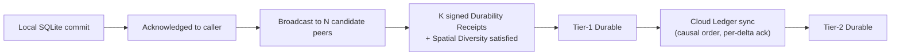
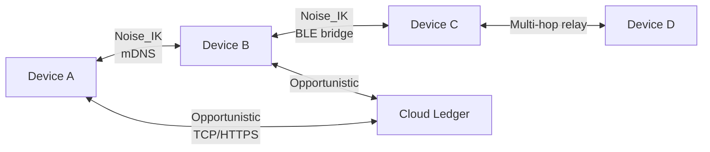

# TirBase

> *Named for Tir — the Armenian god of scribes.*

**An open-source, offline-first Backend-as-a-Service built for teams that operate where the internet doesn't reach.**

TirBase gives your application a fully functional local database that syncs with nearby peers over a self-organizing mesh and reconciles with a cloud ledger the moment connectivity returns — all without a server in the loop. One Rust library. Two build targets. Zero sync code to write.

---

## Why TirBase?

Most BaaS products assume connectivity. TirBase assumes you won't have it.

Disaster relief workers coordinate across temporary radio bridges. Mining crews push data through BLE relays underground. Tactical units sync critical records over LoRa with 256-byte MTUs and regulatory duty-cycle limits. TirBase was designed for exactly these environments — where data must be correct, tamper-evident, and available whether or not a server is reachable.

At the same time, TirBase is a general-purpose local-first data layer. Any application that benefits from instant local reads and writes, automatic peer sync, and eventually-consistent cloud backup fits the model.

---

## How It Works



Every device runs the same `tirbase-core` Rust library — compiled to WASM on the client and to a native binary in the cloud. The public API surface is enforced identical across both targets at compile time, so behaviour never diverges between a field device and the ledger.

---

## Features

### Local-First Storage
Reads and writes commit to SQLite before returning. Your application is fully functional with no peers and no cloud. When peers appear, they sync automatically. When cloud connectivity arrives, outstanding deltas flush in causal order.

### Automerge 3.0 CRDT Sync
Every write becomes a signed Automerge delta. Concurrent edits from different devices merge automatically:
- **Scalar fields** — Last-Write-Wins with Lamport timestamp tiebreaking, then actor ID lexicographic order.
- **Lists and text** — RGA sequence merge preserves all concurrent insertions without dropping either edit.
- **Causal DAG** — every delta records its causal parents, giving you a complete, auditable history of every change.

### Peer-to-Peer Mesh Networking
Devices discover each other via mDNS on local IP networks and BLE routing bridges for Bluetooth-only paths. Tree and multi-hop topologies up to a configurable hop count are supported. MTU fragmentation handles transports as small as 256 bytes — LoRa, Iridium satellite, and similar constrained links work out of the box.

### Noise_IK Session Cryptography
All peer sessions are encrypted with `Noise_IK_25519_AESGCM_SHA256`. 0-RTT resumption (LRU cache, 1024 entries, 24 h validity) minimises handshake overhead on reconnect. Session keys rotate on a configurable interval without dropping the connection. Revoked peers are refused at the handshake layer before any data is exchanged.

### DID-Based Identity and Biscuit Capability Tokens
Every device generates an Ed25519 keypair on first run and derives a `did:key:` DID from it. Every delta is signed. Every incoming delta is verified. Permissions are carried in offline-verifiable Biscuit tokens — no auth server needed. Trust levels (`VERIFIED`, `UNVERIFIED`, `REVOKED`) are surfaced in real time through the TypeScript SDK.

### M-of-N Revocation — Mesh-Accumulated
Revocation doesn't require all M managers to be online simultaneously. Each manager submits their signature independently; TirBase gossips partial revocation deltas at HIGH priority through the mesh and accumulates signatures until the threshold is reached. The revoked device is isolated within one gossip round. The revocation delta is immutable and causally recorded.

### Causal Contamination Engine
When a device is revoked, a migration is found to be corrupted, or a human writes against a contaminated projection, TirBase automatically traces taint forward through the entire Changeset DAG:



Tags are append-only — nothing is ever deleted from the audit log. Composite incidents form automatically when contamination chains share a node and decompose back into independent records when one chain is resolved.

### Zero-Trust Schema Migration Over the Mesh
Schema migrations travel as signed deltas over the mesh — no cloud, no out-of-band distribution. Every migration is verified through a strict gate before execution:



The transform runs inside a `wasmtime` sandbox (native) or a WASM-in-WASM interpreter (client) with no network, no filesystem, and no JavaScript eval path. Migrations can be revoked via M-of-N manager signatures — in-progress transforms are terminated immediately.

### Non-Destructive Migration Recovery
Writes made against a corrupted schema version are preserved in the Side-Car Ledger, not deleted. When a corrected migration arrives, TirBase replays those writes in recorded-timestamp order against the corrected projection. Replay conflicts are flagged for manual resolution without aborting the rest of the replay.

### Two-Tier Durability


Tier-1 requires K peers from spatially diverse squads or tunnel sectors to return signed state-hash receipts. Tier-2 is Cloud Ledger acknowledgement. Compaction from the hot path is permitted at Tier-1 — re-fetch from receipt holders handles Cloud sync. The outbound queue holds up to 100,000 deltas during extended offline periods.

Optional `Anchor_Attested_Location` mode uses fixed BLE/LoRa beacons with cryptographically signed location tokens to harden spatial diversity claims against falsified tags.

### Saturate Mode
A manager holding a Biscuit token with the `disaster-alert` caveat can activate Saturate Mode with a signed `DISASTER_ALERT` message. All available bandwidth routes to HIGH-priority deltas for 60 minutes. MEDIUM and LOW queues are held without dropping. The lease renews with a signed heartbeat or terminates on M-of-N manager threshold.

### Weighted Deficit Round Robin Scheduler
All outbound deltas are classified and scheduled with guaranteed bandwidth floors:

| Priority | Minimum Floor | Classified as |
|---|---|---|
| HIGH | 70% | Revocations, safety alerts, emergency alerts |
| MEDIUM | 20% | Reachability, link-state, session-validity records |
| LOW | 10% | All other application data |

Spare capacity from idle queues flows to the highest-priority backlog first. A LOW-queue delta at or below clearing capacity is transmitted within 10 scheduling epochs (10 seconds).

### Per-Table Compaction Policy
Each table declares its own compaction policy in the schema:

```
table safety_alerts {
  compaction: none     // full Delta history preserved; forensic use
}

table tasks {
  compaction: aggressive(threshold: 500)  // compact when Delta count exceeds 500
}
```

Each table is a separate Automerge document. `CompactionPolicy::None` tables are never compacted, regardless of what happens to other tables.

---

## Architecture Overview



All mesh links are Noise_IK encrypted. Cloud sync is opportunistic and never blocks local operations.

---

## TypeScript SDK

```typescript
import { TirBase } from '@tirbase/sdk';

const db = await TirBase.init({
  storagePath: './local.db',
  deploymentConfig: {
    schema: mySchema,
    revocationThreshold: { m: 2, n: 3 },
    quorum: { k: 3, spatialDiversityMin: 2 },
  },
});

// Writes resolve on local commit — no network required
const result = await db.write({
  table: 'reports',
  key: 'report-42',
  data: { title: 'Situation Report', body: '...' },
});
// result.durabilityTier: 'UNCOMMITTED' | 'TIER1' | 'TIER2'

// Reads and queries are always local
const report = await db.read({ table: 'reports', key: 'report-42' });
const openReports = await db.query({ table: 'reports', filter: { status: 'open' } });

// Trust level and mesh status are synchronous readable properties
console.log(db.trustLevel);  // 'VERIFIED' | 'UNVERIFIED' | 'REVOKED'
console.log(db.meshStatus);  // { status: 'connected', peerCount: 4 }

// Events
db.on('unverified-warning', (w) => console.warn(`Unverified since ${w.unverifiedSince}`));
db.on('durability-tier-changed', (e) => updateDurabilityUI(e));
db.on('incident-created', (ico) => showContaminationBanner(ico));
db.on('incident-updated', (ico) => updateContaminationBanner(ico));
db.on('incident-closed', (ico) => dismissBanner(ico.id));
```

### Manager Operations

```typescript
// Revoke a compromised device — works fully offline
// Each manager calls this independently; signatures accumulate via mesh gossip
await db.initiateRevocation({
  targetDid: 'did:key:z6Mk...',
  managerToken: myBiscuitToken,
});

const status = await db.revocationStatus({ targetDid: 'did:key:z6Mk...' });
// { signaturesCollected: 2, signaturesRequired: 3, status: 'PENDING' }

// Resolve contamination after verifying data integrity
await db.verifyData({ contaminationRootDeltaId: '...', managerToken: myBiscuitToken });

// Archive an incident without certifying data
await db.adminClose({ incidentId: '...', managerToken: myBiscuitToken });

// Activate emergency broadcast mode
await db.activateSaturateMode({
  disasterAlertPayload: '...',
  managerToken: myBiscuitToken,  // must carry 'disaster-alert' caveat
});
```

---

## Crate Structure

```
tirbase-core/
├── src/
│   ├── api/          # Public API — CoreHandle, init(), read(), write(), query()
│   ├── crdt/         # Automerge 3.0 engine, Changeset DAG, LWW/RGA merge paths
│   ├── contamination/# Causal Contamination Engine, Incident Context Objects
│   ├── migration/    # Zero-trust migration gate, WASM sandbox, Side-Car Ledger
│   ├── transport/    # rust-libp2p mesh, DRR scheduler, Saturate Mode, Noise sessions
│   ├── identity/     # DID generation, Ed25519 keypair, Delta signing
│   ├── auth/         # Biscuit tokens, Trust Level state machine, M-of-N revocation
│   ├── durability/   # Two-tier durability, quorum formation, spatial diversity
│   ├── store/        # SQLite connection pool, per-table Automerge docs, compaction
│   ├── schema/       # Schema parser (pest), pretty-printer, SchemaIdentifierHash
│   └── diagnostics/  # v1 startup diagnostics and operational warnings
```

```toml
[features]
default = ["native"]
native  = ["rusqlite/bundled", "wasmtime"]
wasm    = ["wasm-bindgen", "js-sys", "web-sys"]
```

---

## Correctness Guarantees

TirBase ships with a 22-property property-based test suite using `proptest` (200 iterations each). Properties cover:

- **Cross-build convergence** — WASM and native produce byte-for-byte identical state for any ordered Delta sequence, including Migration Deltas (the primary wasm3/wasmtime divergence vector).
- **CRDT causal commutativity** — any valid topological ordering of a Delta set produces identical final state.
- **LWW and RGA merge semantics** — scalar conflicts and concurrent list edits are resolved deterministically.
- **Contamination completeness** — every reachable DAG descendant carries a CONTAMINATED tag; no tag is ever modified or removed.
- **Composite incident formation** — two chains sharing a DAG node produce exactly one Composite_Incident_Instance with the union Delta set.
- **DRR bandwidth floors** — over any 10+ epochs, no class receives less than its guaranteed floor fraction.
- **M-of-N threshold enforcement** — ≤M−1 signatures never trigger revocation; ≥M always does.
- **Zero-trust migration gate** — tampering either the CA signature or the transform bytes always rejects, regardless of check order.
- **Schema determinism** — identical schema structure produces identical hash, independent of declaration order.
- **Saturate Mode state machine** — all four lease invariants hold across every event sequence.

---

## v1 Documented Limitations

TirBase emits structured diagnostic entries at startup for all known operational trade-offs:

1. A device isolated from all peers holding a `Revocation_Delta` retains `UNVERIFIED` access and continues to merge deltas until its Biscuit Token epoch expires.
2. A `1-of-1` revocation configuration gives a single Manager DID unilateral exile power with no second approval required.
3. Without `Anchor_Attested_Location`, spatial diversity quorum protects against honest device failure but not against a device that falsifies its own squad or tunnel_sector tag.
4. LoRa and satellite transports are subject to regulatory duty-cycle limits — TirBase does not assume continuous channel availability on those transports.
5. Multi-hop routing uses tree topology. Hub-and-spoke routing via a static local relay is not implemented in v1.
6. A Biscuit Token TTL exceeding 24 hours gives a partitioned or compromised device valid token access for the full configured duration if it never receives a Revocation Delta.

---

## Built On

| Library | Role |
|---|---|
| [`automerge`](https://automerge.org) | CRDT engine (Automerge 3.0, Hexane columnar storage) |
| [`biscuit-auth`](https://www.biscuitsec.org) | Offline-verifiable capability tokens |
| [`ed25519-dalek`](https://github.com/dalek-cryptography/ed25519-dalek) | Ed25519 keypair generation, signing, and verification |
| [`rust-libp2p`](https://libp2p.io) | P2P transport, mDNS discovery, Gossipsub |
| [`snow`](https://github.com/mcginty/snow) | Noise Protocol Framework — Noise_IK_25519_AESGCM_SHA256 |
| [`wasmtime`](https://wasmtime.dev) | Sandboxed WASM runtime for migration transforms (native) |
| [`rusqlite`](https://github.com/rusqlite/rusqlite) | SQLite bindings for the Local Store |
| [`proptest`](https://proptest-rs.github.io/proptest/) | Property-based testing |

---

## License

TirBase is open-source software released under the [MIT License](LICENSE).

---

*TirBase — data that survives the field.*
